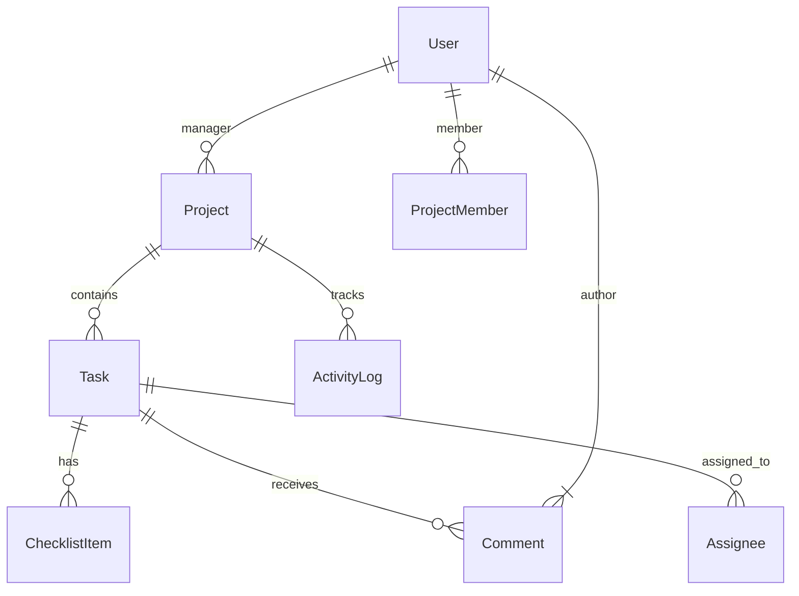

# Architecture Overview 🏛

TaskForge is engineered as a decoupled Client-Server ecosystem, optimized for high performance, enterprise-grade security, and a premium user experience.

## 🏗 System Design

### 🛰 Component Flow

The application follows a strict bidirectional flow:

1. **Request**: The **React Client** triggers typed API calls via a unified `api.ts` client.
2. **Security**: **Express Middlewares** intercept requests for JWT verification and RBAC permission checks.
3. **Logic**: **Controllers** process business rules (progress calculation, data mapping).
4. **Persistence**: **Prisma ORM** interacts with the **PostgreSQL** database using a type-safe schema.
5. **Response**: Data is returned in a standard JSON format, which the client uses to update global and component-local states via **Zustand**.

### 🔐 Multi-Layered Security

- **Global RBAC**: Built-in hierarchy for platform-wide administration.
- **Project Scoping**: Strict isolation where members can't see or act on projects they aren't part of.
- **Data Integrity**: Backend validation via **Zod schemas** ensures that no malformed data reaches the persistence layer.

## 💾 Database Schema (Simplified)

## 🚀 Performance Optimizations

- **Relational Inclusions**: We use Prisma's `include` feature to fetch nested relations (like assignees and tags) in a single optimized query.
- **Lazy Loading**: Frontend routes and heavy components (like charts) are loaded dynamically to reduce initial bundle size.
- **Zustand Caching**: Global application state is persisted where necessary to avoid redundant network requests.
